## B1 – Ngữ cảnh nghiệp vụ và vấn đề nghiệp vụ
Business Context
| **Nội dung**           | **Mô tả**                                              |
| ---------------------- | ------------------------------------------------------ |
| **Tên hệ thống**       | CAB System – Nền tảng đặt xe                           |
| **Doanh nghiệp**       | Công ty ABC                                            |
| **Mục đích**           | Cung cấp dịch vụ đặt xe trực tuyến cho khách hàng      |
| **Khách hàng**         | Đặt xe, theo dõi chuyến, thanh toán và đánh giá tài xế |
| **Tài xế**             | Nhận chuyến, thực hiện chuyến và cập nhật trạng thái   |
| **Nhân viên vận hành** | Quản lý khách hàng, tài xế, phương tiện và chuyến đi   |
| **Ban lãnh đạo**       | Theo dõi báo cáo và hiệu quả kinh doanh                |
| **Hệ thống bên ngoài** | Nhà cung cấp thanh toán và nhà cung cấp thông báo      |

Business Problems
| **Mã**   | **Vấn đề nghiệp vụ**              | **Hệ quả**                               |
| -------- | --------------------------------- | ---------------------------------------- |
| **BP01** | Phân công tài xế còn thủ công     | Điều phối xe chưa tự động và khó mở rộng |
| **BP02** | Khó theo dõi trạng thái chuyến    | Thiếu khả năng theo dõi chuyến           |
| **BP03** | Thanh toán chưa quản lý tập trung | Tính cước và thanh toán chưa thống nhất  |
| **BP04** | Khó mở rộng hệ thống              | Nền tảng thiếu khả năng mở rộng          |
| **BP05** | Thông báo chưa linh hoạt          | Khó mở rộng kênh thông báo               |
| **BP06** | Thiếu công cụ quản lý vận hành    | Thiếu công cụ giám sát tập trung         |
| **BP07** | Thiếu dữ liệu và báo cáo          | Thiếu dữ liệu phục vụ quản lý            |

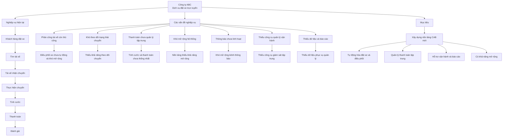

---

# B2 – Stakeholder
Stakeholder List
| **Mã**   | **Stakeholder**         | **Vai trò / Mối quan tâm**                      |
| -------- | ----------------------- | ----------------------------------------------- |
| **ST01** | Khách hàng              | Đặt xe, theo dõi chuyến, thanh toán và đánh giá |
| **ST02** | Tài xế                  | Nhận / từ chối và thực hiện chuyến              |
| **ST03** | Nhân viên vận hành      | Quản lý và xử lý sự cố                          |
| **ST04** | Ban giám đốc            | Mục tiêu kinh doanh và báo cáo                  |
| **ST05** | Business Analyst        | Thu thập và xác nhận yêu cầu                    |
| **ST06** | Đội phát triển          | Xây dựng và triển khai                          |
| **ST07** | Nhà cung cấp thanh toán | Xử lý thanh toán điện tử                        |
| **ST08** | Nhà cung cấp thông báo  | Cung cấp dịch vụ thông báo                      |
Stakeholder Matrix
| **Stakeholder**         | **Quyền lực** | **Mức độ quan tâm** | **Cách quản lý**              |
| ----------------------- | ------------- | ------------------- | ----------------------------- |
| Ban giám đốc            | Cao           | Cao                 | Quản lý chặt chẽ              |
| Nhân viên vận hành      | Cao           | Cao                 | Quản lý chặt chẽ              |
| Khách hàng              | Thấp          | Cao                 | Theo dõi và thu thập phản hồi |
| Tài xế                  | Thấp          | Cao                 | Theo dõi và thu thập phản hồi |
| Business Analyst        | Trung bình    | Cao                 | Phối hợp thường xuyên         |
| Đội phát triển          | Trung bình    | Trung bình          | Phối hợp khi cần              |
| Nhà cung cấp thanh toán | Thấp          | Thấp                | Theo dõi                      |
| Nhà cung cấp thông báo  | Thấp          | Thấp                | Theo dõi                      |

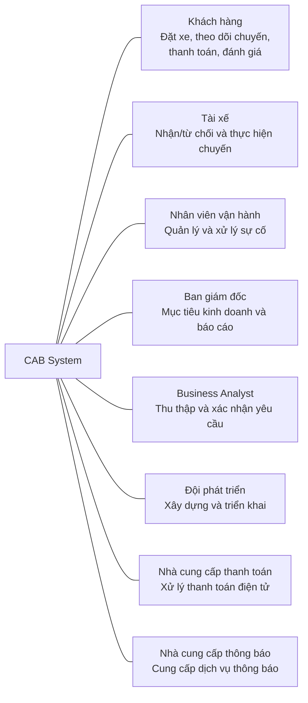

### Stakeholder Matrix

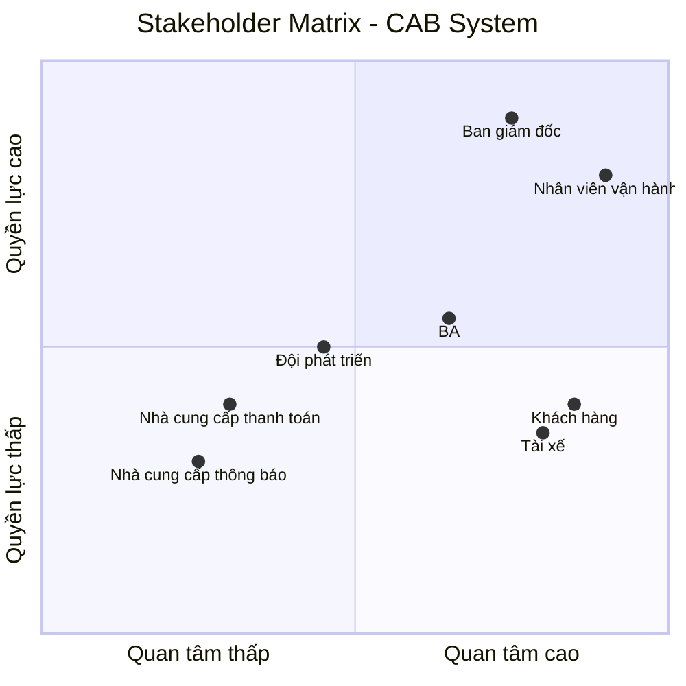

---

# B3 – Business Goal
| **Mã BG** | **Business Goal**                 |
| :-------: | --------------------------------- |
|  **BG01** | Tự động tìm và điều phối tài xế   |
|  **BG02** | Thanh toán tiền mặt và trực tuyến |
|  **BG03** | Quản lý và theo dõi chuyến đi     |
|  **BG04** | Quản lý tài khoản và người dùng   |
|  **BG05** | Hỗ trợ vận hành                   |
|  **BG06** | Cung cấp thông báo                |
|  **BG07** | Cung cấp báo cáo quản trị         |
|  **BG08** | Ổn định và mở rộng                |
|  **BG09** | An toàn và bảo mật                |
|  **BG10** | Mở rộng chức năng tương lai       |

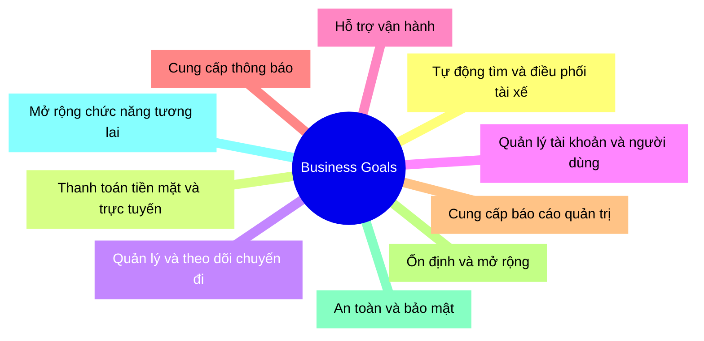

---

# B4 – Scope
In Scope – Phạm vi phải làm
| **STT** | **Chức năng**           |
| :-----: | ----------------------- |
|    1    | Quản lý tài khoản       |
|    2    | Đặt xe                  |
|    3    | Tìm và điều phối tài xế |
|    4    | Nhận / từ chối chuyến   |
|    5    | Theo dõi chuyến         |
|    6    | Thực hiện chuyến        |
|    7    | Tính cước               |
|    8    | Thanh toán              |
|    9    | Thông báo               |
|    10   | Quản trị vận hành       |
|    11   | Báo cáo                 |
|    12   | Bảo mật và phân quyền   |
Out of Scope – Không nên làm
| **STT** | **Nội dung**                          |
| :-----: | ------------------------------------- |
|    1    | Tự xây hệ thống thanh toán            |
|    2    | Lưu thông tin thẻ trực tiếp           |
|    3    | Tự xây hệ thống bản đồ GPS            |
|    4    | Xây ứng dụng cho nhà cung cấp         |
|    5    | Tự xây hạ tầng SMS / Email / Push     |
|    6    | Tự quyết định cách tính cước          |
|    7    | Tự quyết định tiêu chí ưu tiên tài xế |
|    8    | Tự quyết định chính sách hủy          |
|    9    | Tự quyết định thời gian phản hồi      |
|    10   | Triển khai dịch vụ mới ngay           |

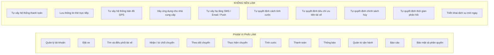

---

# B5 – Business Requirement
| **Mã BR** | **Business Requirement**   |
| :-------: | -------------------------- |
|  **BR01** | Tự động tìm tài xế         |
|  **BR02** | Đặt xe                     |
|  **BR03** | Quản lý nhận chuyến        |
|  **BR04** | Tìm tài xế thay thế        |
|  **BR05** | Theo dõi chuyến            |
|  **BR06** | Cập nhật trạng thái chuyến |
|  **BR07** | Tính cước                  |
|  **BR08** | Thanh toán                 |
|  **BR09** | Thông báo                  |
|  **BR10** | Quản lý vận hành           |
|  **BR11** | Báo cáo                    |
|  **BR12** | Bảo mật và phân quyền      |
|  **BR13** | Khả năng mở rộng           |

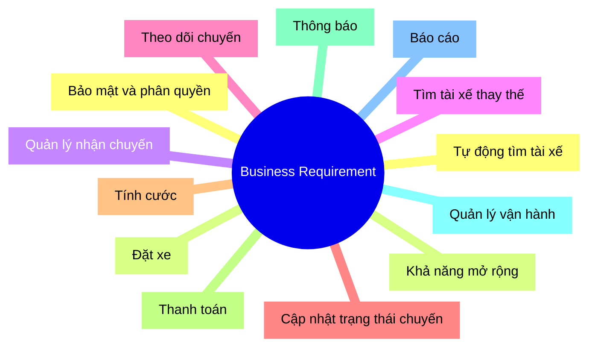

---

# B6 – Business Process
| **Mã BP** | **Tên quy trình**           | **Mô tả ngắn**                       |
| :-------: | --------------------------- | ------------------------------------ |
|  **BP01** | Đăng ký & quản lý tài khoản | Người dùng tạo và quản lý tài khoản  |
|  **BP02** | Đặt xe                      | Khách hàng tạo yêu cầu đặt xe        |
|  **BP03** | Tìm & điều phối tài xế      | Hệ thống tìm và phân công tài xế     |
|  **BP04** | Nhận / từ chối chuyến       | Tài xế xử lý yêu cầu chuyến          |
|  **BP05** | Thực hiện & theo dõi chuyến | Tài xế thực hiện và cập nhật chuyến  |
|  **BP06** | Tính cước & thanh toán      | Tính số tiền và thực hiện thanh toán |
|  **BP07** | Gửi thông báo               | Gửi thông báo đến người dùng         |
|  **BP08** | Đánh giá sau chuyến         | Khách hàng đánh giá tài xế           |
|  **BP09** | Quản lý vận hành            | Nhân viên vận hành quản lý hệ thống  |
|  **BP10** | Báo cáo & quản trị          | Cung cấp dữ liệu và báo cáo          |

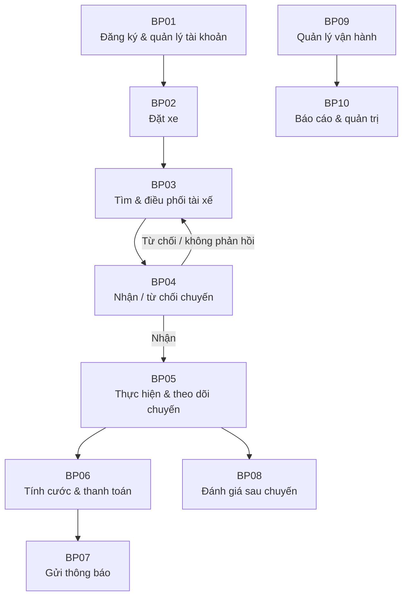

---

# B7 – Functional Requirement
| **Mã FR** | **Functional Requirement**      |
| :-------: | ------------------------------- |
|  **FR01** | Đăng ký tài khoản               |
|  **FR02** | Đăng nhập                       |
|  **FR03** | Quản lý thông tin cá nhân       |
|  **FR04** | Tạo yêu cầu đặt xe              |
|  **FR05** | Tìm tài xế phù hợp              |
|  **FR06** | Gửi yêu cầu đến tài xế          |
|  **FR07** | Nhận / từ chối chuyến           |
|  **FR08** | Tìm tài xế thay thế             |
|  **FR09** | Thông báo không tìm được tài xế |
|  **FR10** | Theo dõi trạng thái chuyến      |
|  **FR11** | Cập nhật trạng thái chuyến      |
|  **FR12** | Cập nhật vị trí tài xế          |
|  **FR13** | Tính cước                       |
|  **FR14** | Thanh toán                      |
|  **FR15** | Xử lý thanh toán thất bại       |
|  **FR16** | Gửi thông báo                   |
|  **FR17** | Xem lịch sử chuyến              |
|  **FR18** | Đánh giá tài xế                 |
|  **FR19** | Quản lý vận hành                |
|  **FR20** | Tra cứu giao dịch               |
|  **FR21** | Xử lý sự cố                     |
|  **FR22** | Báo cáo hoạt động               |
|  **FR23** | Phân quyền                      |

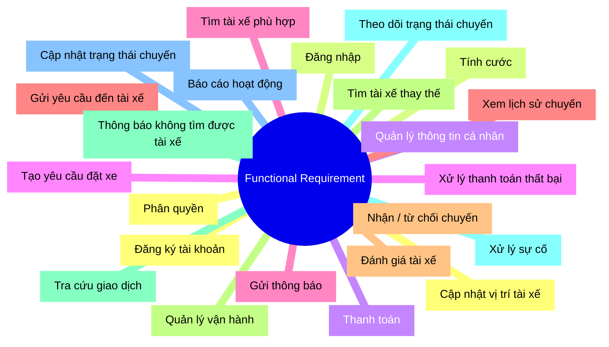

---

# B8 – Business Rule + Exception
Business Rules
|   **Mã**  | **Business Rule**      |
| :-------: | ---------------------- |
| **BRU01** | Tài xế phải sẵn sàng   |
| **BRU02** | Ưu tiên tài xế phù hợp |
| **BRU03** | Tài xế nhận chuyến     |
| **BRU04** | Tài xế từ chối         |
| **BRU05** | Không phản hồi         |
| **BRU06** | Không tìm được tài xế  |
| **BRU07** | Trình tự trạng thái    |
| **BRU08** | Tính cước              |
| **BRU09** | Thanh toán             |
| **BRU10** | Bảo mật thanh toán     |
| **BRU11** | Đánh giá sau chuyến    |
| **BRU12** | Phân quyền             |
| **BRU13** | Lưu vết                |
Exception
|  **Mã**  | **Exception**         |
| :------: | --------------------- |
| **EX01** | Không tìm thấy tài xế |
| **EX02** | Tài xế từ chối        |
| **EX03** | Tài xế không phản hồi |
| **EX04** | Thanh toán thất bại   |
| **EX05** | Mất kết nối           |
| **EX06** | Chuyến bị lỗi         |
| **EX07** | Không có quyền        |

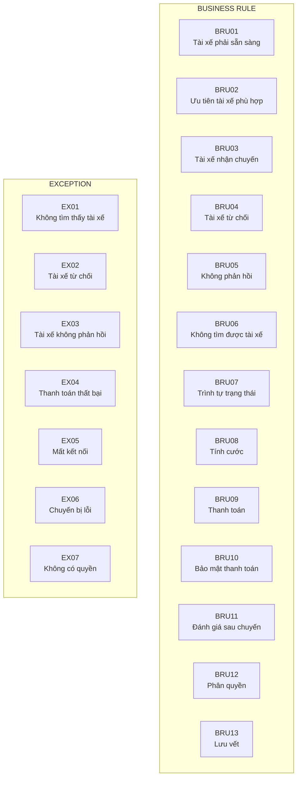

---

# B9 – Data Modeling / ERD
Entity List
| **Entity**            | **Mục đích**                   |
| --------------------- | ------------------------------ |
| **CUSTOMER**          | Lưu thông tin khách hàng       |
| **DRIVER**            | Lưu thông tin tài xế           |
| **VEHICLE**           | Lưu thông tin phương tiện      |
| **SERVICE**           | Lưu loại dịch vụ               |
| **TRIP**              | Lưu thông tin chuyến đi        |
| **DRIVER_ASSIGNMENT** | Lưu thông tin phân công tài xế |
| **PAYMENT**           | Lưu thông tin thanh toán       |
| **RATING**            | Lưu đánh giá chuyến đi         |
| **NOTIFICATION**      | Lưu thông tin thông báo        |
Entity Attributes
| **Entity**            | **Attributes**                                                                                          |
| --------------------- | ------------------------------------------------------------------------------------------------------- |
| **CUSTOMER**          | customer_id (PK), name, phone, email                                                                    |
| **DRIVER**            | driver_id (PK), name, phone, status                                                                     |
| **VEHICLE**           | vehicle_id (PK), driver_id (FK), license_plate, vehicle_type                                            |
| **SERVICE**           | service_id (PK), service_name                                                                           |
| **TRIP**              | trip_id (PK), customer_id (FK), service_id (FK), pickup_location, destination, status, fare, created_at |
| **DRIVER_ASSIGNMENT** | assignment_id (PK), trip_id (FK), driver_id (FK), status, assigned_at, responded_at                     |
| **PAYMENT**           | payment_id (PK), trip_id (FK), amount, method, status                                                   |
| **RATING**            | rating_id (PK), trip_id (FK), score, comment                                                            |
| **NOTIFICATION**      | notification_id (PK), recipient_type, recipient_id, content, status                                     |
Relationships
| **Entity 1** | **Quan hệ** | **Entity 2**      |
| ------------ | :---------: | ----------------- |
| CUSTOMER     |    1 – N    | TRIP              |
| SERVICE      |    1 – N    | TRIP              |
| TRIP         |    1 – N    | DRIVER_ASSIGNMENT |
| DRIVER       |    1 – N    | DRIVER_ASSIGNMENT |
| DRIVER       |    1 – N    | VEHICLE           |
| TRIP         |    1 – 1    | PAYMENT           |
| TRIP         |   1 – 0/1   | RATING            |
| CUSTOMER     |    1 – N    | NOTIFICATION      |
| DRIVER       |    1 – N    | NOTIFICATION      |

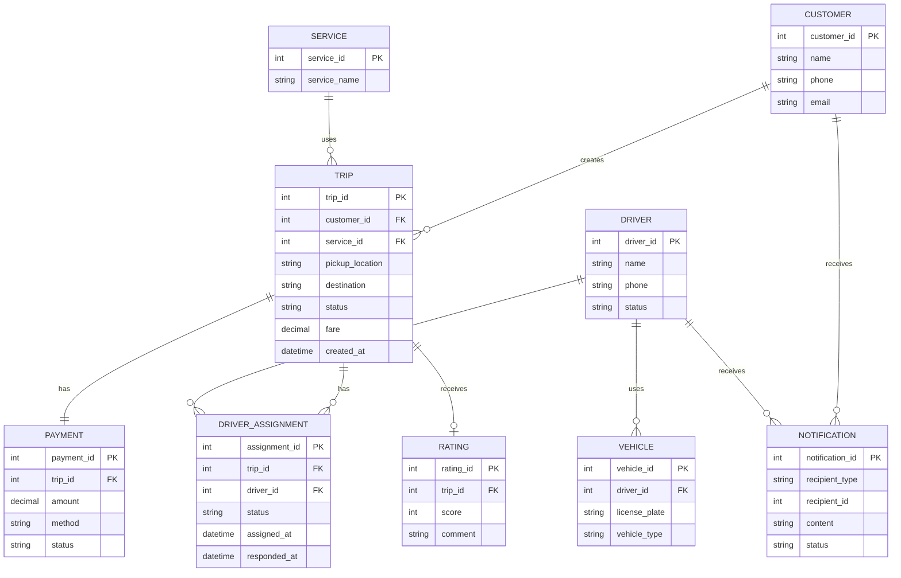

---

# B10 – Non-functional Requirement
| **Mã NFR** | **Nhóm**                   | **Non-functional Requirement**                            |
| :--------: | -------------------------- | --------------------------------------------------------- |
|  **NFR01** | Hiệu năng                  | Hệ thống có thời gian phản hồi phù hợp                    |
|  **NFR02** | Khả năng mở rộng           | Hệ thống có khả năng mở rộng khi số lượng người dùng tăng |
|  **NFR03** | Tính sẵn sàng              | Hệ thống hoạt động ổn định                                |
|  **NFR04** | Khả năng phục hồi          | Lỗi ở một thành phần không làm dừng toàn bộ hệ thống      |
|  **NFR05** | Bảo mật                    | Bảo vệ dữ liệu người dùng và giao dịch                    |
|  **NFR06** | Xác thực & phân quyền      | Kiểm soát quyền truy cập theo vai trò                     |
|  **NFR07** | Khả năng tích hợp          | Có khả năng tích hợp với dịch vụ bên ngoài                |
|  **NFR08** | Khả năng bảo trì           | Có thể bảo trì và thay đổi các thành phần                 |
|  **NFR09** | Khả năng mở rộng chức năng | Có thể bổ sung chức năng mới                              |
|  **NFR10** | Lưu vết & kiểm toán        | Lưu log các thao tác quan trọng                           |

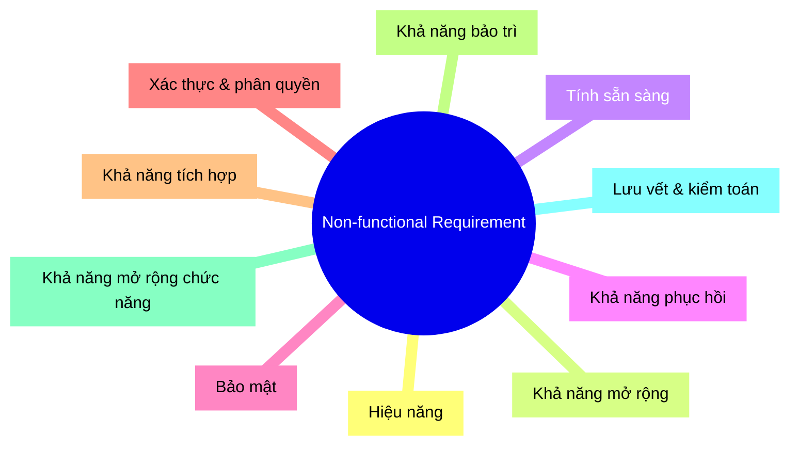

---

# B11 – Use Case Diagram
Use Case List
| **Mã UC** | **Use Case**           | **Actor chính**                     |
| :-------: | ---------------------- | ----------------------------------- |
|  **UC01** | Quản lý tài khoản      | Khách hàng, Tài xế                  |
|  **UC02** | Đặt xe                 | Khách hàng                          |
|  **UC03** | Tìm & phân công tài xế | Nhân viên vận hành                  |
|  **UC04** | Nhận / từ chối chuyến  | Tài xế                              |
|  **UC05** | Thực hiện chuyến       | Tài xế                              |
|  **UC06** | Theo dõi chuyến        | Khách hàng, Nhân viên vận hành      |
|  **UC07** | Tính cước              | Hệ thống                            |
|  **UC08** | Thanh toán             | Khách hàng, Nhà cung cấp thanh toán |
|  **UC09** | Gửi thông báo          | Hệ thống, Nhà cung cấp thông báo    |
|  **UC10** | Xem lịch sử chuyến     | Khách hàng                          |
|  **UC11** | Đánh giá tài xế        | Khách hàng                          |
|  **UC12** | Quản lý vận hành       | Nhân viên vận hành                  |
|  **UC13** | Xử lý sự cố            | Nhân viên vận hành                  |
|  **UC14** | Tra cứu giao dịch      | Nhân viên vận hành                  |
|  **UC15** | Xem báo cáo            | Ban lãnh đạo, Nhân viên vận hành    |
Actors
| **Actor**                   | **Vai trò**                                   |
| --------------------------- | --------------------------------------------- |
| **Khách hàng**              | Đặt xe, theo dõi chuyến, thanh toán, đánh giá |
| **Tài xế**                  | Nhận / từ chối và thực hiện chuyến            |
| **Nhân viên vận hành**      | Quản lý và xử lý sự cố                        |
| **Ban lãnh đạo**            | Theo dõi mục tiêu kinh doanh và báo cáo       |
| **Nhà cung cấp thanh toán** | Xử lý thanh toán điện tử                      |
| **Nhà cung cấp thông báo**  | Cung cấp dịch vụ thông báo                    |
Use Case Relationships
| **Use Case**                  | **Quan hệ** | **Use Case được liên kết**    |
| ----------------------------- | :---------: | ----------------------------- |
| UC02 – Đặt xe                 |  `include`  | UC03 – Tìm & phân công tài xế |
| UC03 – Tìm & phân công tài xế |  `include`  | UC09 – Gửi thông báo          |
| UC05 – Thực hiện chuyến       |  `include`  | UC07 – Tính cước              |
| UC07 – Tính cước              |  `include`  | UC08 – Thanh toán             |
| UC08 – Thanh toán             |  `include`  | UC09 – Gửi thông báo          |
| UC05 – Thực hiện chuyến       |  `include`  | UC09 – Gửi thông báo          |

### B12 – Requirement Traceability

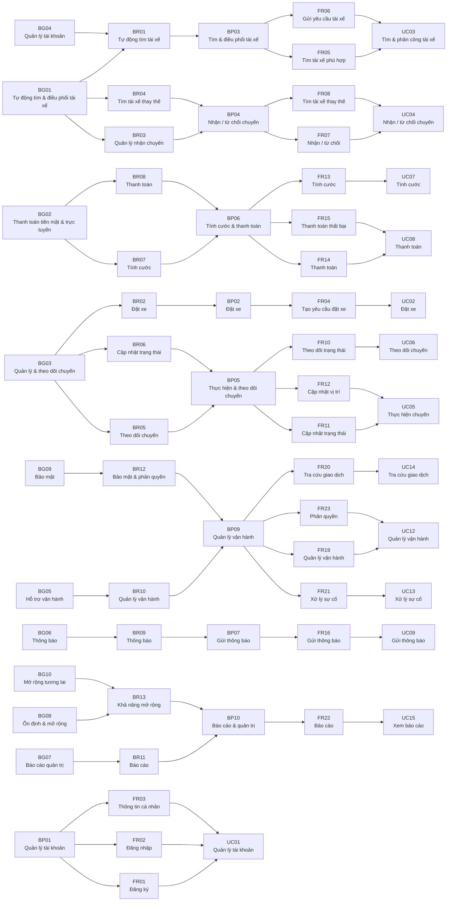

# B13 – Acceptance Criteria (AC)

| **Mã AC** | **Acceptance Criteria** |
|:---:|---|
| **AC01** | Khách hàng có thể đăng ký, đăng nhập và cập nhật thông tin tài khoản thành công. |
| **AC02** | Khách hàng có thể nhập điểm đón, điểm đến, chọn loại xe và gửi yêu cầu đặt xe. |
| **AC03** | Hệ thống tự động tìm tài xế phù hợp dựa trên trạng thái sẵn sàng, vị trí và tiêu chí đã được doanh nghiệp xác nhận. |
| **AC04** | Khi tài xế từ chối hoặc không phản hồi, hệ thống tiếp tục tìm tài xế khác mà khách hàng không cần tạo lại yêu cầu. |
| **AC05** | Khi không tìm được tài xế, hệ thống phải thông báo rõ cho khách hàng. |
| **AC06** | Tài xế có thể nhận chuyến và hệ thống không tiếp tục phân công chuyến đó cho tài xế khác. |
| **AC07** | Tài xế có thể cập nhật đúng các trạng thái của chuyến theo trình tự hợp lệ. |
| **AC08** | Khách hàng có thể theo dõi trạng thái chuyến trong quá trình thực hiện. |
| **AC09** | Sau khi chuyến hoàn thành, hệ thống xác định được số tiền khách hàng phải trả theo chính sách doanh nghiệp. |
| **AC10** | Khách hàng có thể thanh toán bằng tiền mặt hoặc phương thức điện tử được hỗ trợ. |
| **AC11** | Khi thanh toán điện tử thất bại, hệ thống thông báo kết quả và cho phép xử lý lại theo chính sách doanh nghiệp. |
| **AC12** | Hệ thống gửi thông báo đến đúng khách hàng hoặc tài xế khi xảy ra các sự kiện quan trọng. |
| **AC13** | Khách hàng có thể xem lịch sử chuyến và đánh giá tài xế sau khi chuyến hoàn thành. |
| **AC14** | Nhân viên vận hành có thể quản lý khách hàng, tài xế, phương tiện và chuyến đi theo quyền được cấp. |
| **AC15** | Nhân viên vận hành có thể tra cứu giao dịch và hỗ trợ xử lý chuyến bị lỗi. |
| **AC16** | Ban lãnh đạo có thể xem báo cáo về số chuyến, doanh thu, tỷ lệ hoàn thành, tỷ lệ hủy và hiệu quả tài xế. |
| **AC17** | Người dùng không có quyền không thể thực hiện chức năng quản trị không được phép. |
| **AC18** | Các thao tác quản trị quan trọng được lưu vết để phục vụ kiểm tra. |

# B14 – Requirement Traceability Matrix (RTM)

| **BG** | **BR** | **FR**           | **UC** |   **AC**   |
| :----: | :----: | :--------------- | :----: | :--------: |
|  BG01  |  BR01  | FR05, FR06       |  UC03  |    AC03    |
|  BG01  |  BR03  | FR07             |  UC04  |    AC06    |
|  BG01  |  BR04  | FR08             |  UC04  |    AC04    |
|  BG02  |  BR07  | FR13             |  UC07  |    AC09    |
|  BG02  |  BR08  | FR14, FR15       |  UC08  | AC10, AC11 |
|  BG03  |  BR02  | FR04             |  UC02  |    AC02    |
|  BG03  |  BR05  | FR10             |  UC06  |    AC08    |
|  BG03  |  BR06  | FR11, FR12       |  UC05  |    AC07    |
|  BG04  |  BR01  | FR01, FR02, FR03 |  UC01  |    AC01    |
|  BG05  |  BR10  | FR19             |  UC12  |    AC14    |
|  BG05  |  BR10  | FR21             |  UC13  |    AC15    |
|  BG05  |  BR10  | FR20             |  UC14  |    AC15    |
|  BG06  |  BR09  | FR16             |  UC09  |    AC12    |
|  BG07  |  BR11  | FR22             |  UC15  |    AC16    |
|  BG09  |  BR12  | FR23             |  UC12  |    AC17    |
|  BG09  |  BR12  | —                |  UC12  |    AC18    |
|  BG10  |  BR13  | —                |    —   |      —     |

### Sơ đồ B14
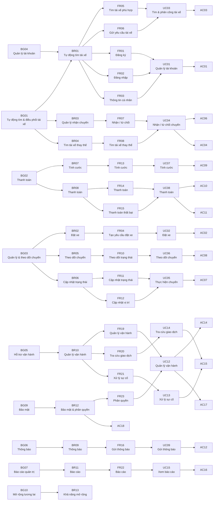

