## B1 – Ngữ cảnh nghiệp vụ và vấn đề nghiệp vụ

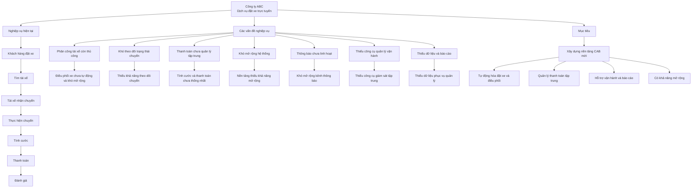

---

# B2 – Stakeholder

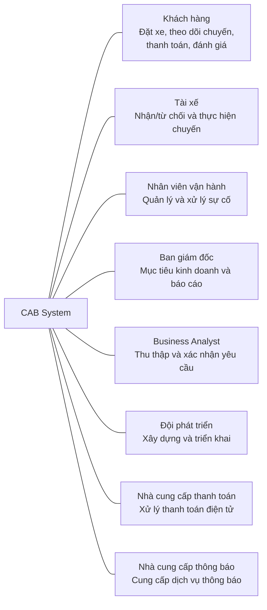

### Stakeholder Matrix

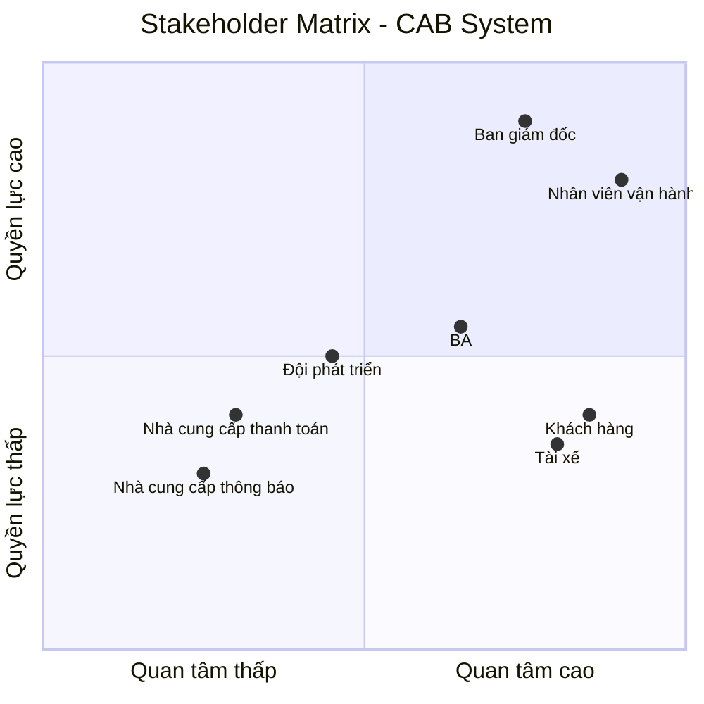

---

# B3 – Business Goal

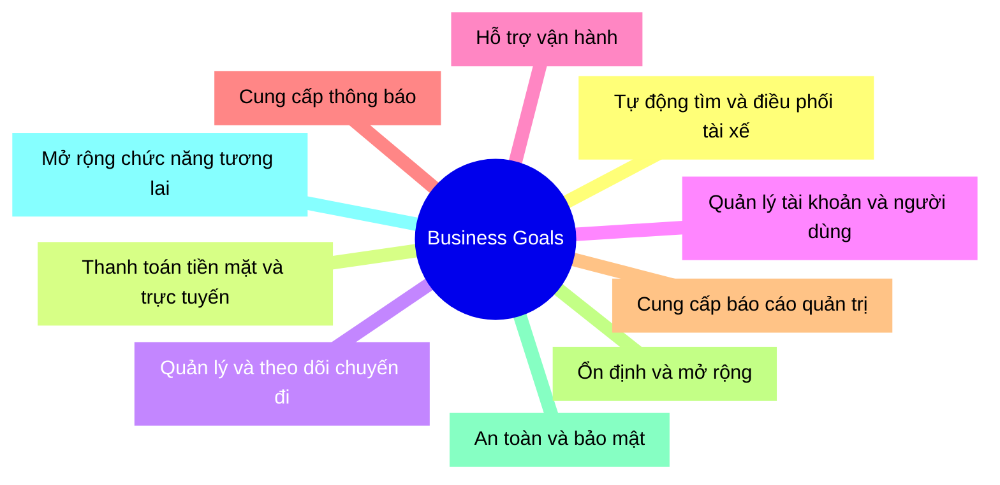

---

# B4 – Scope

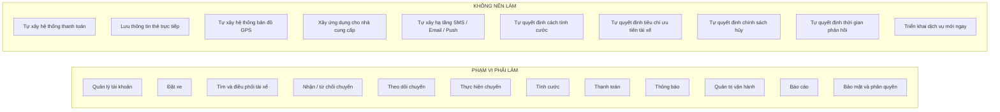

---

# B5 – Business Requirement

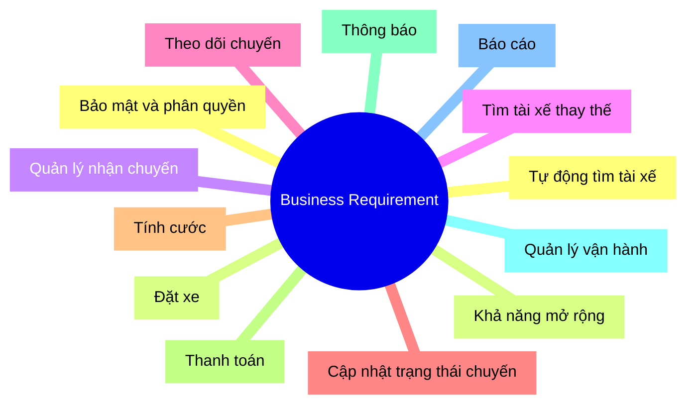

---

# B6 – Business Process

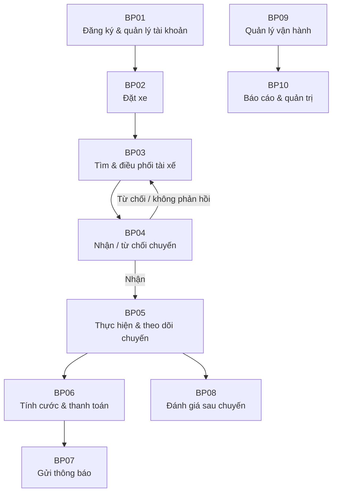

---

# B7 – Functional Requirement

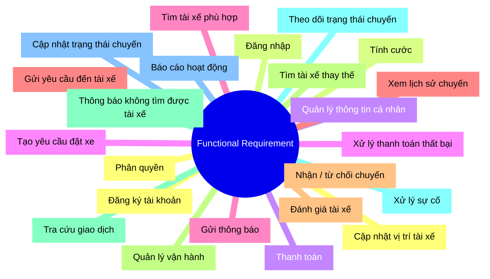

---

# B8 – Business Rule + Exception

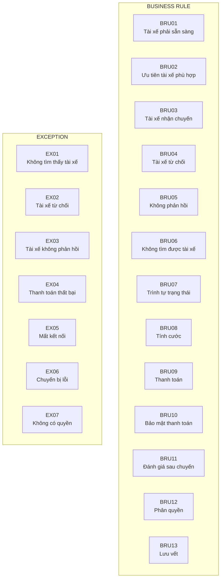

---

# B9 – Data Modeling / ERD

Đây là sơ đồ quan trọng nhất của B9:

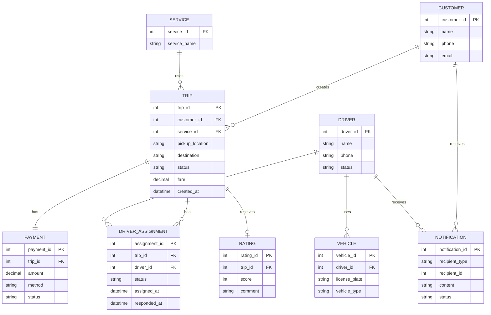

---

# B10 – Non-functional Requirement

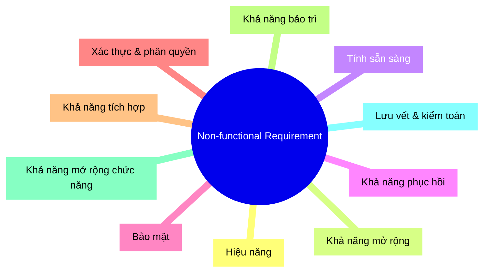

---

# B11 – Use Case Diagram

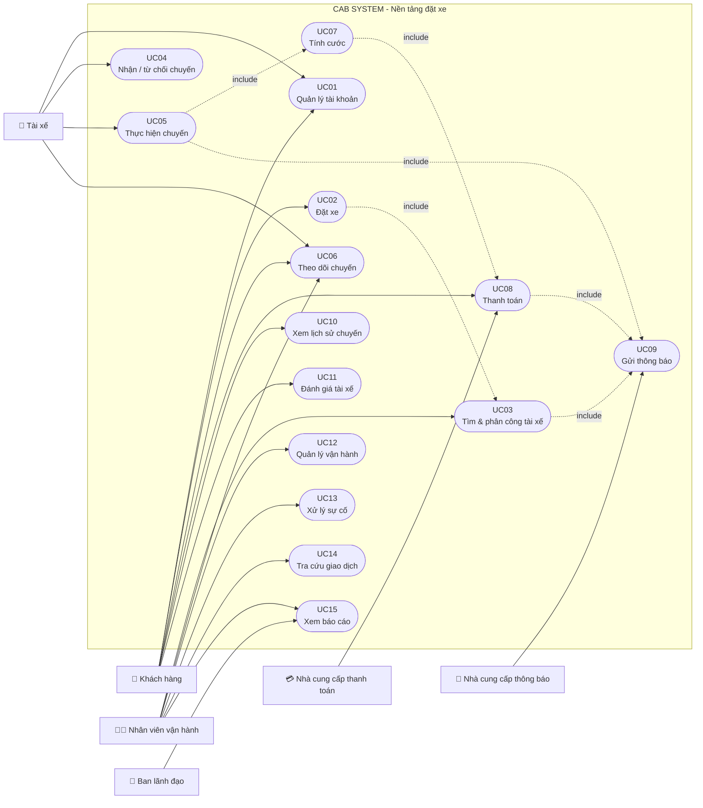

## Bộ này bạn nên giữ làm “xương sống” của dự án

Quan trọng nhất là **không sửa mã lung tung** về sau:

**B1:** Context + Problem
**B2:** Stakeholder
**B3:** BG01–BG10
**B4:** Scope
**B5:** BR01–BR13
**B6:** BP01–BP10
**B7:** FR01–FR23
**B8:** BRU01–BRU13 + EX01–EX07
**B9:** Entity + ERD
**B10:** NFR01–NFR10
**B11:** UC01–UC15

b12 truy xuat nguon goc yeu cau
Đúng. **B12 – Truy xuất nguồn gốc yêu cầu (Requirement Traceability)** là bước để chứng minh rằng **mỗi yêu cầu đều xuất phát từ đâu và được triển khai xuống đâu**.

Với dự án CAB, để sau này làm Test Case không bị quá tải, mình khuyên **không truy xuất từng câu chữ**, mà nối theo chuỗi:

**Business Goal → Business Requirement → Business Process → Functional Requirement → Business Rule → Use Case → Test Case**

---

# B12 – Requirement Traceability

## 1. Ma trận truy xuất nguồn gốc yêu cầu

| BG   | BR               | BP         | FR                     | BRU / EX                  | UC               |
| ---- | ---------------- | ---------- | ---------------------- | ------------------------- | ---------------- |
| BG01 | BR01             | BP03       | FR05, FR06             | BRU01, BRU02              | UC03             |
| BG01 | BR03, BR04       | BP04       | FR07, FR08             | BRU03, BRU04, BRU05       | UC04             |
| BG02 | BR07, BR08       | BP06       | FR13, FR14, FR15       | BRU08, BRU09, BRU10, EX04 | UC07, UC08       |
| BG03 | BR02, BR05, BR06 | BP02, BP05 | FR04, FR10, FR11, FR12 | BRU07, EX05               | UC02, UC05, UC06 |
| BG04 | BR04             | BP01       | FR01, FR02, FR03       | BRU12, EX07               | UC01             |
| BG05 | BR10             | BP09       | FR19, FR21             | EX06, EX07                | UC12, UC13       |
| BG06 | BR09             | BP07       | FR16                   | —                         | UC09             |
| BG07 | BR11             | BP10       | FR22                   | —                         | UC15             |
| BG08 | BR13             | BP10       | —                      | —                         | —                |
| BG09 | BR12             | BP09       | FR23                   | BRU10, BRU12, BRU13       | UC12             |
| BG10 | BR13             | BP10       | —                      | —                         | —                |

### Ý nghĩa

Ví dụ:

**BG01 – Tự động tìm và điều phối tài xế**

↓

**BR01 – Tự động tìm tài xế**

↓

**BP03 – Tìm và điều phối tài xế**

↓

**FR05 – Tìm tài xế phù hợp**
**FR06 – Gửi yêu cầu đến tài xế**

↓

**BRU01 – Tài xế phải sẵn sàng**
**BRU02 – Ưu tiên tài xế phù hợp**

↓

**UC03 – Tìm và phân công tài xế**

Sau này từ **UC03** mới thiết kế Test Case.

---

# 2. Sơ đồ Traceability bằng Mermaid

Bạn có thể copy đoạn này vào Mermaid:

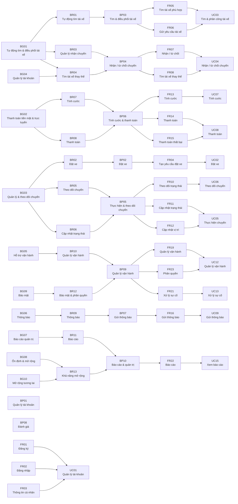

---

## 3. Tại sao B12 rất quan trọng cho Test Case?

B12 giúp mình **không phải nghĩ Test Case từ đầu**.

Ví dụ chỉ cần nhìn:

> **BG01 → BR01 → BP03 → FR05 → UC03**

thì biết ngay phải kiểm thử chức năng:

**“Hệ thống có tìm được tài xế phù hợp hay không?”**

Sau đó mới sinh các Test Case:

* Tài xế đang sẵn sàng → tìm được.
* Tài xế không sẵn sàng → không được chọn.
* Có nhiều tài xế → chọn theo tiêu chí đã xác nhận.
* Tài xế từ chối → tìm tài xế khác.
* Không còn tài xế → thông báo khách hàng.

Như vậy **B12 chính là cây cầu nối từ yêu cầu của khách hàng → chức năng hệ thống → Use Case → Test Case**.

Và với dự án của bạn, mình sẽ **không tạo Test Case cho toàn bộ 23 FR một cách máy móc**; sẽ gom theo các **Use Case/luồng nghiệp vụ chính** để một người vẫn làm được.

